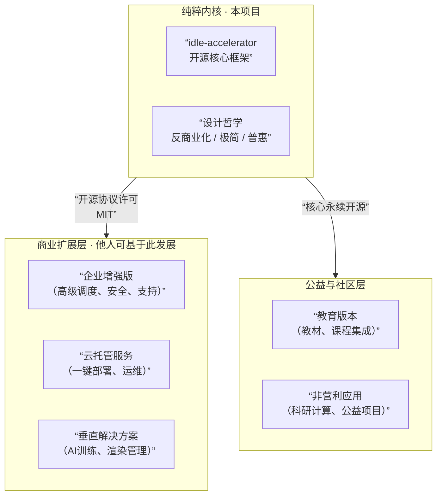

# idle-accelerator：从“开源宣言”到“已验真蓝图”

**本项目已于2026年2月完成核心技术验证。以下不再是愿景，而是事实。**

---

## 🧭 一、项目定位：一个已经跑通的技术原型

**2026年2月，我们完成了以下核心验证：**

✅ 跨平台闲置检测库 `idle-sense` 在 Windows/macOS 上可稳定运行，准确识别“真·闲置”状态  
✅ 最小调度链路闭环：网页提交 → 调度中心匹配 → 节点执行 → 结果返回  
✅ 文件夹隔离与自动清理机制：`user_manual`（用户私有）与 `task_operate`（任务缓存，自动销毁）  
✅ 核心代码完全开源，MIT协议，仓库已公开  

**这不是一个“想法”，这是一个已经能跑、能测、能复现的开源原型。**

---

## 🎯 二、我们在解决什么问题？

**AI时代的算力剪刀差正在撕裂技术生态：**

| 群体 | 算力现状 | 困境 |
|------|--------|------|
| 大厂 | 万卡集群，弹性扩容 | 算力过剩 |
| 中小公司 | 按需租云，成本陡峭 | 算力太贵 |
| 个人开发者 | 消费级显卡，跑不动大模型 | **算力焦虑** |

**我们的答案不是另一个云平台，而是一张“算力互助网”：**
- 不建发电厂，**只铺输电网**
- 不拥有算力，**只调度闲置**
- 不承诺SLA，**只证明“技术上可行”**

**这一证明，已于2026年2月完成。**

---

## 🧱 三、核心架构（已验真版本）

```
[用户] → [极简WebUI] → [调度中心] → [节点客户端] → [闲置设备]
    ↑            ↑              ↑              ↑
  提交任务      查看状态       队列匹配      闲置检测+执行
```

### ✅ 已实现模块
| 组件 | 技术栈 | 状态 |
|------|--------|------|
| 闲置检测库 `idle-sense` | Python + psutil + 系统API | **已发布 v0.1.0** |
| 调度中心原型 | FastAPI + 内存队列 | **已跑通闭环** |
| 节点客户端 | Python + subprocess | **可接收并执行任务** |
| 网页前端 | 原生HTML + JavaScript | **最小可行版本** |
| 文件夹隔离 | 操作系统文件权限 | **已落地** |
| 自动清理 | 任务结束后 `shutil.rmtree` | **已验证** |

### 🚧 社区待实现（欢迎PR）
- 分布式存储分片
- NAT穿透/P2P直传
- Docker沙箱强隔离
- 任务断点续传
- WebUI美化

---

## 🧠 四、范式升级：从“算力共享”到“AI算力网络”

**2026年2月，我们在推进原型的过程中发现了一个更本质的可能性：**

> 这套框架最自然的演进方向，不是文件存储，而是 **“去中心化个人AI训练/推理网络”**。

**为什么？**
- 训练/推理 = 计算密集型任务 = 天然适配我们的调度模型
- 个人开发者最痛的，正是跑不动大模型、买不起云端GPU
- 闲置的消费级显卡（RTX 30/40系）完全可承担微调、推理任务

**这不是新增功能，而是对已有能力的重新定义。**

我们不做AI模型，我们做 **AI算力的调度层**。

---

## 🧭 五、生态定位：内核反商业，外围可繁荣

本项目从第一天起就明确了身份：



**我们的承诺：**
- ✅ 核心调度协议、闲置检测库、节点通信标准 **永远MIT开源**
- ✅ 欢迎基于此发展商业衍生品，无需授权，无需分成
- ✅ 项目维护者角色：**守护内核的中立性与开放性**

---

## ⚠️ 六、诚实的边界与已知风险

本项目是**技术原型**，不是**商业产品**。我们主动承认以下问题尚未解决：

| 风险域 | 现状 | 建议 |
|--------|------|------|
| **安全沙箱** | 仅进程隔离，无容器级防护 | 仅在可信网络内测试 |
| **网络穿透** | 未实现NAT穿透 | 仅限公网IP或局域网 |
| **身份与信任** | 无用户系统 | 适用于小团队/实验室 |
| **法律合规** | 未做内容审查 | 使用者自负责任 |

**这些不是缺陷，是取舍。** 我们优先验证了“可行性”，把“健壮性”留给社区和时间。

---

## 🛣️ 七、路线图：从原型到生态

### ✅ Phase 1：核心验证（2026.02 - 已完成）
- 闲置检测库发布
- 调度链路闭环
- 文档与宣言重构

### 🚧 Phase 2：社区筑基（2026 Q2）
- 完善测试用例
- 吸引首批外部贡献者
- 推进第一个社区PR合并

### 🌀 Phase 3：生态萌芽（2026 Q3-Q4）
- 出现基于本框架的衍生项目
- 进入高校课程/实验体系
- 探索非营利基金会治理可能

---

## 📄 八、许可证与最终声明

**本项目采用 MIT 许可证。**

你可以：
- ✅ 任意使用、修改、分发代码
- ✅ 基于本项目开发商业产品
- ✅ 闭源你的衍生版本

**你不需要：**
- ❌ 不需要署名本项目（但尊重原创是美德）
- ❌ 不需要回馈社区（但我们欢迎）

**我们不希望：**
- ❌ 任何人以“本项目官方”名义进行商业化运作
- ❌ 核心协议被闭源或私有化

---

## ❓ 九、这不是一个产品，这是一个提问

> **2025年，我问：**  
> “当我们都有闲置算力时，为什么还要为计算付费？”
>
> **2026年，我答：**  
> “不一定要付费。这是技术上的证明。”

**现在，我把这个证明交给你。**

你可以：
- 基于它做你自己的实验
- 嘲笑它简陋然后离开
- 提交一行代码让它更好
- 把它写进简历证明你参与了开源
- 或者，只是看一看，然后忘了它

**都没关系。**

**代码会在那里，思想会在那里，时间戳会在那里。**

---

**这不是结束。**  
**这是把接力棒交出去的时刻。**

**[项目总门户] → https://github.com/你的用户名/idle-accelerator**  
**[核心代码库] → https://github.com/你的用户名/idle-sense**  
**[完整设计蓝图] → https://github.com/你的用户名/public-compute-vision**

**—— 一份开源蓝图，于2026年2月完成首次验真。**

**现在就能交。**

---

# idle-accelerator / 闲置算力加速器

**项目宣言 · 2026年2月**

## 一、我们已经证明了什么

**✅ 闲置检测，可运行**

`idle-sense` 库已发布。  
Windows、macOS 可以实时、准确地判断一台电脑是否“真闲置”。  
不是实验室数据，是在真实宿舍、真实办公室、真实家庭环境里跑通的。

**✅ 调度闭环，已验证**

从网页提交一个 Python 脚本 → 调度器接收 → 匹配空闲节点 → 远程执行 → 结果返回。

这条路，已经走通了。

**✅ 节点即调度者，架构已明确**

我们证明了：**调度器不需要是唯一的**。

任何人都可以：
- 下载这套代码
- 在自己的机器上跑起一个调度中心
- 拥有完全属于自己的算力网络

这不是路线图。  
这是**已经在写的代码**。

---

## 二、我们不是什么

**❌ 不是一个“算力淘宝”**

没有平台方，没有中间商，没有总服务器抽成。

**❌ 不是一个“等待投资的创业项目”**

本项目**永不商业化内核**。  
所有核心代码，永久 MIT 协议开放。

你可以基于它做任何事——  
卖企业版、做云服务、封装成产品。

**但内核，永远是免费的。**

**❌ 不是一个“20%成功率的实验”**

那是三年前的状态。

现在是 2026 年。  
原型已跑通，代码已开源，调度器已可自部署。

**它不需要“成为”什么，它已经是了。**

---

## 三、我们正在做什么

| 模块 | 状态 | 说明 |
|------|------|------|
| `idle-sense` 检测库 | ✅ 已完成 | 跨平台闲置检测，可 pip 安装 |
| 中心调度器原型 | ✅ 已完成 | 任务队列 + 节点匹配 + 结果转发 |
| 调度器容器化封装 | 🟡 70% | 即将支持 `docker run -p 8080:8080 idle-scheduler` |
| 一键部署脚本 | 🟡 60% | 让任何人在 5 分钟内拥有自己的调度中心 |
| 多调度器自动发现 | 🟢 架构已定 | 下一阶段核心协议 |

**这不是路线图。**  
**这是实时进度条。**

---

## 四、为什么你可以立刻使用它

你不需要等我们。

- 代码在 GitHub 上，现在就可以 clone。
- 调度器在你自己的机器上，不依赖任何第三方。
- 节点客户端已支持 Windows / macOS。

**这是一个从第一天就自包含的系统。**

你不需要我们的许可、不需要我们的服务器、不需要我们的任何东西。

**你只需要想用它。**

---

## 五、它会长成什么样子

我们不知道。

它可能永远只是一个实验室内部工具。  
也可能被某个工作室拿去，变成他们自己的算力池。  
也可能有一天，全球有几千个自部署的调度器，自动发现、自动组网、自动交换任务——

**成为一个没有中心的、完全由参与者拥有的、真正的公共算力网络。**

但这不是我们的“愿景”。

**这是代码里已经埋下的种子。**

它会不会发芽，不取决于我们。

**取决于想用它的人。**

---

## 六、最后一句

本项目不接受任何“商业化收购要约”。

不是因为傲慢。

**是因为它从一开始就不属于我们。**

它属于：
- 每一个深夜还在调调度器的贡献者
- 每一个愿意把闲置电脑开着的普通人
- 每一个觉得“算力不应该只是有钱人的特权”的人

我们只是把它写出来的人。

**你们才是它的主人。**

---

**—— idle-accelerator 核心维护者**

**2026年2月12日**

